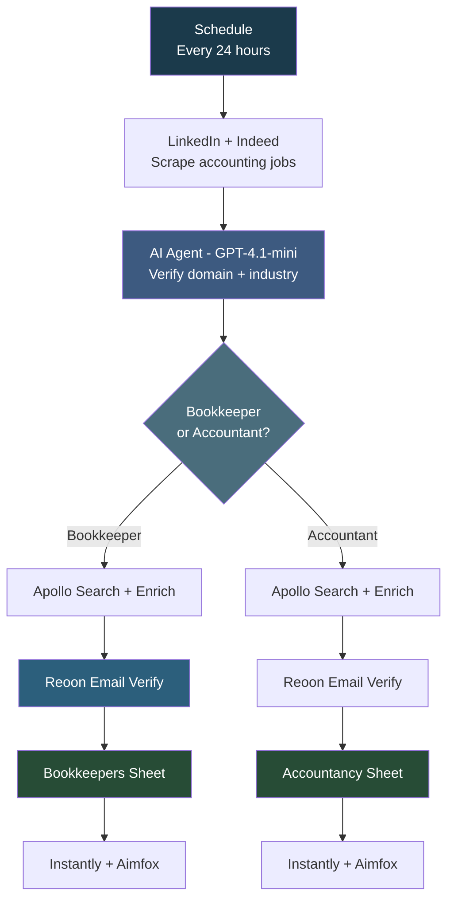

# HR Agency Jobs Scrape Workflow

## Overview

This is a **daily automated pipeline targeting accounting and bookkeeping firms** that are hiring. It scrapes job postings from LinkedIn (two scrapers) and Indeed, uses AI to verify each company's domain and classify their industry, splits leads into bookkeeper vs accountant tracks, finds decision-makers via Apollo, verifies emails through Reoon, logs to separate Google Sheets, and pushes to Instantly and Aimfox for outreach. Nearly identical to the FlexScale Flow but with different credentials and configuration.

## How It Works

```
Schedule (24h) -> Scrape LinkedIn + Indeed -> Filter Accounting Jobs -> AI Verify Domains -> Split Bookkeeper/Accountant -> Apollo Search + Enrich -> Email Verify -> Sheets -> Instantly + Aimfox
```

### Workflow Diagram



## Integrations

- **Apify** - LinkedIn and Indeed job scraping
- **OpenAI (GPT-4.1-mini)** - Domain verification and industry classification
- **Tavily** - Web search for domain lookup
- **Apollo.io** - People search and bulk enrichment
- **Reoon** - Bulk email verification
- **Google Sheets** - Separate bookkeeper and accountant sheets
- **Instantly** - Email outreach
- **Aimfox** - LinkedIn outreach

## Setup

1. Import `HR_Agency_Jobs_Scrape_Workflow.json` into your n8n instance.
2. Update all credentials.
3. Activate the workflow to run every 24 hours.
